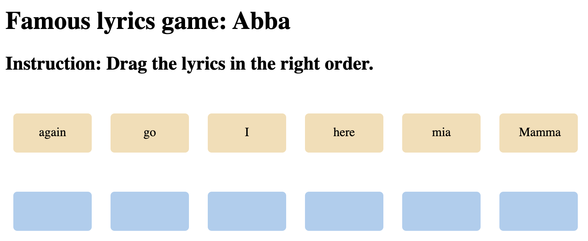

# Drag-Drop-Web-Api-VanillaJS
-- Learning Drag-Drop Web Api using Vanilla JS 
-- Article used: https://dev.to/jscrambler/build-a-simple-game-in-vanilla-js-with-the-drag-and-drop-api-58lf?utm_source=echojs.com&utm_medium=referral&utm_campaign=build-simple-game 
 
# Demo: 
 

 
# Enhancements:
- Add Reset button.
- Add a start and end screen; 
- Add a counter that would count the number of attempts; 
- Add a countdown timer that would not limit the number of attempts, but rather the time available for us to complete our puzzle game; 
- Add more questions; 
- Add a leaderboard (we’d need to persist our data somehow); 
- Refactor the logic of our game so that we can keep the questions and the order of words in a simple JS object; 
- Fetch the questions from a remote API. 
